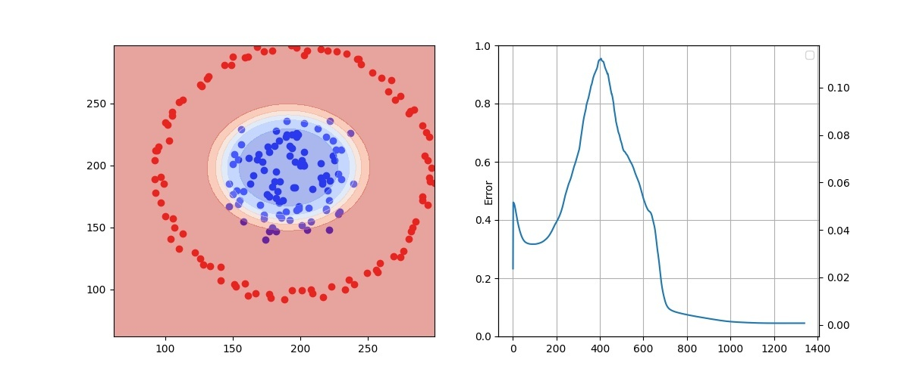
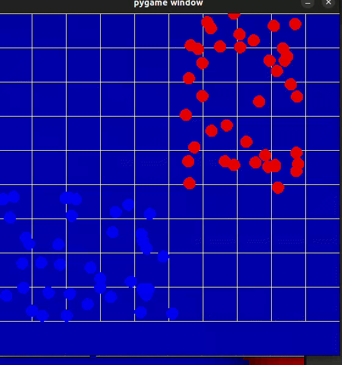

An implementation of a neural network and layer class meant to enhance the mathematics involved. As such use of optimized matrix operations such as np.dot are ommited for the purpose of
getting to the fundamentals. 

<h5>Simple example of a three layer network using the class to distinguish two clussters</h5>

